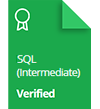

    

# HackerRank | Practice, Tutorials & Interview Preparation Solutions

This repository consists of solutions to HackerRank **practice**, **tutorials**, and **interview preparation** problems with **Python**, **SQL**, **C++**, and **Java**.

## Personal HackerRank Profile

[View Profile](https://www.hackerrank.com/edaaydinea)

## HackerRank Badges

    
    
    
    
    
    

## HackerRank Certificates

    
    
     
    

